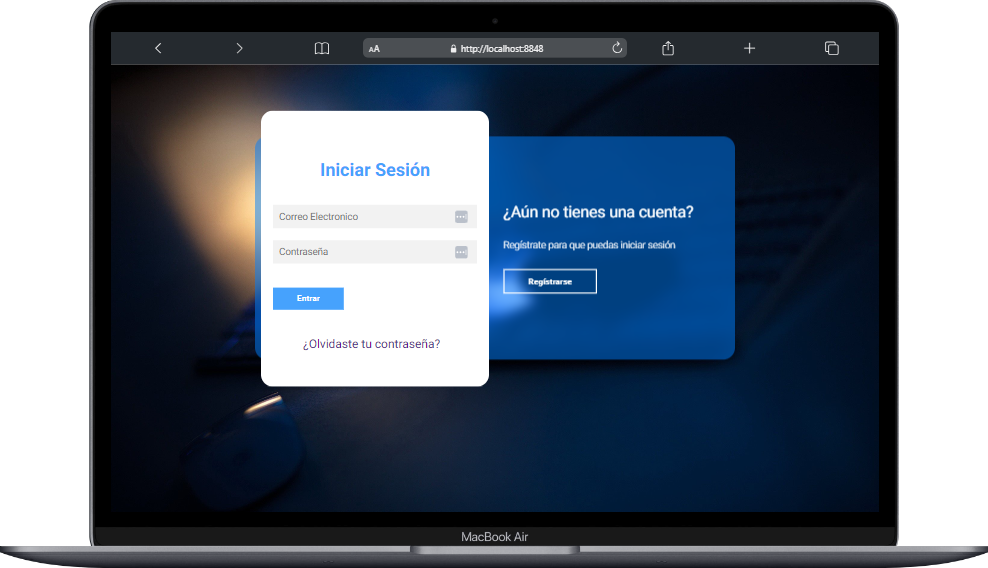

# Página de Login y Registro Moderno - HTML

Este archivo HTML representa una página de inicio de sesión diseñada específicamente para una página web. La página proporciona un formulario donde los usuarios pueden ingresar su correo electrónico y contraseña para acceder.

    

    
# Contenido

- [Página de Login y Registro Moderno - HTML](#página-de-login-y-registro-moderno---html)
- [Contenido](#contenido)
  - [Características Destacadas](#características-destacadas)
  - [Contenido Principal](#contenido-principal)
  - [Instrucciones de Uso](#instrucciones-de-uso)
  - [Contribución](#contribución)

## Características Destacadas

- **Formulario de Inicio de Sesión**: Incluye campos para el correo electrónico y la contraseña, con validaciones de entrada.

- **Enlaces Adicionales**: Ofrece enlaces para restablecer la contraseña y registrar una nueva cuenta.

- **Diseño Responsivo**: Se adapta a diferentes tamaños de pantalla, desde dispositivos móviles hasta pantallas de escritorio.

## Contenido Principal

- **Estructura HTML**: El archivo sigue las mejores prácticas de estructura HTML con elementos como `<!DOCTYPE>`, `<html>`, `<head>`, `<meta>`, `<title>`, `<body>`, etc.

- **Formulario de Inicio de Sesión**: El formulario utiliza el método POST para enviar datos a un destino especificado en el atributo `action`.

- **Estilos**: Se hace referencia a una hoja de estilo externa ("login.css") para aplicar estilos a la página.

## Instrucciones de Uso

Para utilizar este archivo HTML en tu proyecto:

1. Clona o descarga el repositorio que contiene este archivo HTML.

2. Asegúrate de que los enlaces a las hojas de estilo y los scripts sean correctos y que los archivos estén ubicados en las rutas especificadas.

3. Personaliza el contenido, los enlaces y la lógica del formulario según las necesidades específicas de tu proyecto.

4. Asegúrate de proporcionar una página de destino adecuada en el atributo `action` del formulario (`<form action="index.html">`) para procesar los datos del formulario correctamente.

## Contribución

Si deseas contribuir o mejorar este archivo HTML:

1. Haz un fork del repositorio.

2. Realiza tus cambios y mejoras en tu propio fork.

3. Envía un pull request para que tus cambios sean revisados y, si se aprueban, se fusionen con el repositorio original.